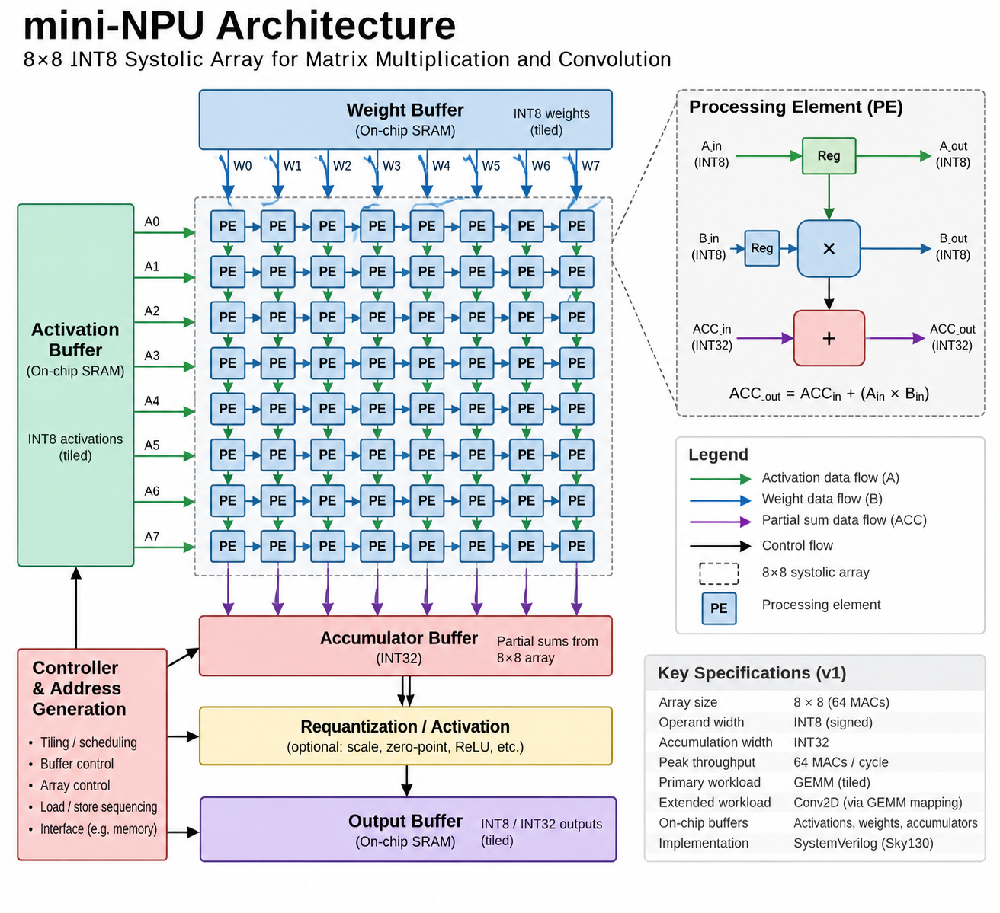

# mini-NPU

A custom INT8 neural processing unit (NPU) implemented in SystemVerilog for accelerating matrix-heavy inference workloads. The design is centered around an 8×8 systolic MAC array, providing 64 parallel INT8 multiply-accumulate units with INT32 accumulation.

This project explores the architecture and implementation of a dedicated hardware accelerator from RTL through synthesis and static timing analysis, with a focus on compute utilization, data reuse, memory bandwidth, and the tradeoff between peak and sustained throughput.

## Motivation

General-purpose processors spend a significant amount of execution time moving data and repeatedly issuing arithmetic instructions for matrix-heavy workloads. Neural-network inference provides substantial data-level parallelism, making it a natural target for dedicated hardware acceleration.

The goal of this project is to explore that tradeoff directly in RTL: replace instruction-driven execution with a parallel MAC array and design the surrounding dataflow required to keep the compute units utilized.

Rather than focusing only on functional matrix multiplication, the project aims to measure how architectural choices such as array dimensions, tiling, buffering, and data reuse affect actual hardware utilization and throughput.

---

## Architecture Overview

The initial architecture targets INT8 inference using an 8×8 systolic array.

<div align="center">
    
</div>

### Target Specifications

* **Compute:** 8×8 systolic array / 64 parallel MAC units
* **Operands:** signed INT8 activations and weights
* **Accumulation:** INT32
* **Peak compute:** 64 MACs/cycle
* **Primary workload:** tiled general matrix multiplication (GEMM)
* **Extended workload:** Conv2D mapped onto the matrix-multiply engine
* **RTL:** SystemVerilog
* **Verification:** self-checking simulation + SystemVerilog Assertions
* **ASIC target:** SkyWater 130nm HD

The compute array is designed around a parameterized processing element (PE), with each PE performing an INT8 multiply followed by accumulation into a wider INT32 datapath.

Matrices larger than the physical array are divided into tiles and executed across multiple passes, allowing the same hardware to operate on varying matrix dimensions.

---

## Design Challenges

The main challenge is not simply implementing 64 multipliers in parallel, but keeping those compute units supplied with useful data.

The design explores several accelerator-specific problems:

* **Dataflow:** scheduling activations, weights, and partial sums through the systolic array
* **Data reuse:** minimizing repeated accesses by reusing operands across multiple MAC operations
* **Array utilization:** reducing idle PE cycles caused by array fill/drain and workload dimensions
* **Tiling:** mapping matrices larger than the physical 8×8 array onto the available hardware
* **Accumulation width:** maintaining numerical correctness while accumulating INT8 products
* **Memory bandwidth:** balancing operand delivery bandwidth against available compute throughput
* **Control:** coordinating buffer accesses, array execution, accumulation, and output generation

A theoretical 8×8 array can execute 64 MAC operations per cycle. A major goal of the project is to quantify how closely real workloads approach that limit.

### Performance Metrics

The design will be evaluated using:

* MAC operations per cycle
* MAC-array utilization
* cycles per matrix multiplication
* peak vs. sustained throughput
* data movement / memory accesses
* maximum clock frequency
* standard-cell area

For implementation results, effective compute throughput will be evaluated from both achieved MAC throughput and post-synthesis/post-layout clock frequency rather than array size alone.

---

## Formal Verification (SVA)

SystemVerilog Assertions are used alongside simulation to verify architectural invariants and control behavior.

Planned properties include:

* correct PE accumulation behavior
* valid-data propagation through the array
* accumulator reset/clear behavior
* control-state sequencing
* buffer address bounds
* correct transaction completion
* absence of invalid writes during idle/stall conditions

Formal properties and SymbiYosys scripts are located under `/2-formal/`.

---

## Timing Analysis (Sky130 Post-Synth)

The NPU will be synthesized against the SkyWater 130nm HD standard-cell library using Yosys and analyzed with OpenSTA.

Timing analysis will characterize:

* critical-path delay
* maximum clock frequency
* setup timing
* standard-cell count
* synthesized cell area
* critical datapath location

The final performance analysis will combine sustained compute utilization with achievable clock frequency to estimate effective accelerator throughput.

Physical implementation using OpenROAD may also be used to evaluate placement-aware timing, routing, and physical area.

---

## Repository Structure

```text
/0-rtl/    - SystemVerilog RTL for the NPU datapath and control
/1-sim/    - self-checking testbenches and benchmark workloads
/2-formal/ - SystemVerilog assertions + SymbiYosys scripts
/3-sta/    - Yosys/OpenSTA synthesis and timing analysis scripts
/4-images/ - architecture diagrams and implementation figures
```

---

## Build & Simulate

### Compile

```bash
# Commands will be added as the RTL implementation develops.
```

### Run

```bash
# Benchmark and regression commands will be added here.
```

---

## Project Goals

The initial goal is to build and verify a complete INT8 matrix-multiply accelerator around an 8×8 systolic MAC array.

The project will then characterize the difference between theoretical and achieved compute throughput by measuring PE utilization, execution cycles, and data-movement overhead across different matrix dimensions.

The final design will be synthesized and timed on Sky130 to evaluate the relationship between compute parallelism, hardware cost, clock frequency, and sustained accelerator throughput.

---

Thanks for stopping by!
